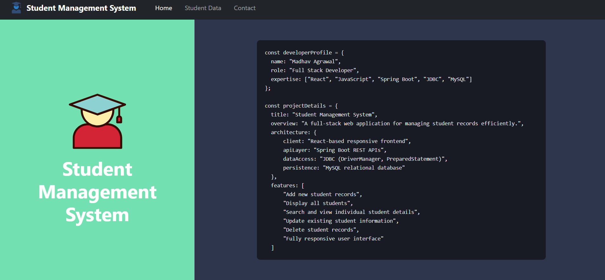
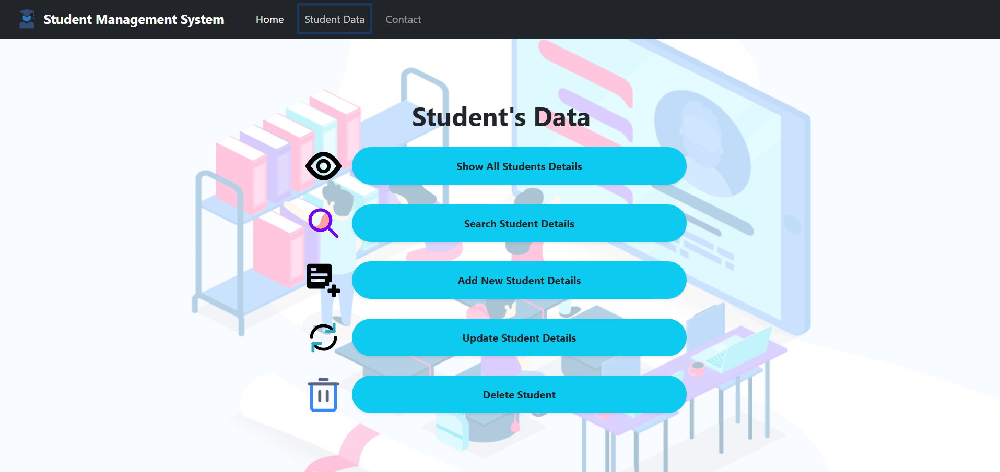

## 🎓 Student Management System – Frontend

### **Project Overview**
A modern, responsive **Student Management System** built using **React.js**.  
This application works as the **frontend (client-side)** of a decoupled full-stack system and communicates with a **Spring Boot REST API** backed by a **MySQL** database.

---

## 🚀 Live Links

- **Live Demo:** https://fullstack-studentdb-madhav.netlify.app  
- **Backend API:** https://student-management-system-backend-jssl.onrender.com/students  
  *Note: The backend is hosted on a free instance, and may take ~1 minute to wake up on the first request.* 

---

## 📸 Screenshots

### **Home**

### **Operations on Student Data**

---

## ✨ Features

### 🖥️ User Interface & Experience
- Interactive dashboard with tabular student data view  
- Fully responsive design for mobile, tablet, and desktop  
- Smooth SPA navigation using **React Router DOM**

### 🛠️ Core Functionality (CRUD)
- **Create:** Add students with Roll Number, Name, Age, and Marks  
- **Read:** Fetch real-time data from Render-hosted backend API  
- **Update:** Edit and update student records  
- **Delete:** Remove students from cloud-hosted MySQL database  

### 🔒 Technical Integration
- CORS-enabled communication with backend  
- Basic form validation and error handling  
- State management using React Hooks (`useState`, `useEffect`)  

---

## 🛠️ Tech Stack

- **Frontend:** React.js  
- **Routing:** React Router DOM  
- **API Client:** Fetch API  
- **Styling:** HTML5, CSS3, Bootstrap  
- **Deployment:** Netlify  

---

## 🏗️ System Architecture

- **Frontend (Netlify):** Handles UI and API requests  
- **Backend (Render):** Spring Boot REST API with JDBC  
- **Database (Railway):** MySQL for persistent storage  

---

## ⚙️ Deployment Configuration (Netlify)

To support React Router on Netlify, a `_redirects` file is included in the `public/` directory:

---

## 👤 Author

**Madhav Agrawal**

---

## 📄 License

This project is built for learning, practice, and portfolio purposes.

